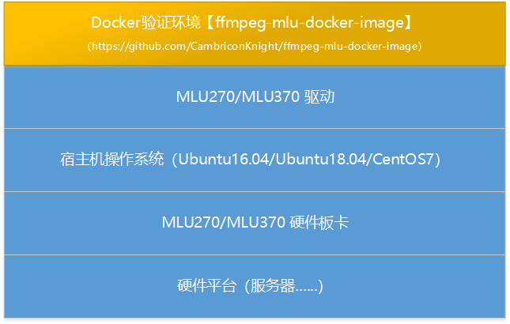

<p align="center">
    <a href="https://gitee.com/cambriconknight/ffmpeg-mlu-docker-image">
        <h1 align="center">FFmpeg-MLU环境搭建与验证</h1>
    </a>
</p>

# 1. 概述

本工具集主要基于Docker容器进行[FFmpeg-MLU](https://github.com/Cambricon/ffmpeg-mlu)环境搭建与验证。力求压缩寒武纪FFmpeg-MLU环境搭建与功能验证的时间成本, 以便快速上手寒武纪FFmpeg-MLU。

<p align="left">
    
</p>

*本工具集仅用于个人学习，打通流程； 不对效果负责，不承诺商用。*

**说明:**

基于寒武纪® MLU硬件平台，寒武纪 FFmpeg-MLU使用纯C接口实现硬件加速的视频编解码。

## 1.1. 硬件环境准备

| 名称            | 数量       | 备注                |
| :-------------- | :--------- | :------------------ |
| 开发主机/服务器 | 一台       |主流配置即可；电源功率按需配置；PCIe Gen.3 x16/Gen.4 x16 |
| MLU270/MLU370    | 一套       | 二选一, 尽量避免混插混用 |

## 1.2. 软件环境准备

| 名称                   | 版本/文件                                    | 备注            |
| :-------------------- | :-------------------------------             | :--------------- |
| Linux OS              | Ubuntu16.04/Ubuntu18.04/CentOS7   | 宿主机操作系统   |
| 以下为MLU270软件依赖包           |  |  |
| Driver_MLU270         | neuware-mlu270-driver-dkms_4.9.8_all.deb    | [手动下载](ftp://username@download.cambricon.com:8821/product/GJD/MLU270/1.7.604/Ubuntu16.04/Driver/neuware-mlu270-driver-dkms_4.9.8_all.deb)   |
| CNToolkit_MLU270      | cntoolkit_1.7.5-1.ubuntu16.04_amd64.deb   | [手动下载](ftp://username@download.cambricon.com:8821/product/GJD/MLU270/1.7.604/Ubuntu16.04/CNToolkit/cntoolkit_1.7.5-1.ubuntu16.04_amd64.deb)   |
| CNCV_MLU270           | cncv_0.4.602-1.ubuntu16.04_amd64.deb    | [手动下载](ftp://username@download.cambricon.com:8821/product/GJD/MLU270/1.7.604/Ubuntu16.04/CNCV/cncv_0.4.602-1.ubuntu16.04_amd64.deb)   |
| 以下为MLU370软件依赖包           |  |  |
| Driver_MLU370         | cambricon-mlu-driver-ubuntu18.04-dkms_5.10.17_amd64.deb    | [手动下载](ftp://lenovogch@download.cambricon.com:8821/product/MLU370/inference+training/1.14.0/driver_v5.10.17)   |
| CNToolkit_MLU370      | cntoolkit_3.6.1-1.ubuntu18.04_amd64.deb   | [手动下载](ftp://lenovogch@download.cambricon.com:8821/product/MLU370/inference+training/1.14.0/cntoolkit_v3.6.1)   |
| CNCV_MLU370           | cncv_2.2.0-1.ubuntu18.04_amd64.deb    | [手动下载](ftp://lenovogch@download.cambricon.com:8821/product/MLU370/inference+training/1.14.0/cncv_v2.2.0)   |
| FFmpeg-MLU            | FFmpeg-MLU   | 自动[下载](https://github.com/Cambricon/ffmpeg-mlu)    |
| FFmpeg                | FFmpeg   | 自动[下载](https://gitee.com/mirrors/ffmpeg.git)    |

*以上软件包涉及FTP手动下载的,可下载到本地[dependent_files](./dependent_files)目录下,方便对应以下步骤中的提示操作。*

*以上软件包也可关注微信公众号 【 AIKnight 】, 发送关键字 **FFmpeg-MLU** 自动获取,获取后放置到本地[dependent_files](./dependent_files)目录下,方便对应以下步骤中的提示操作。*

**AIKnight公众号**
>

## 1.3. 资料下载

MLU开发文档: https://developer.cambricon.com/index/document/index/classid/3.html

Neuware SDK: https://cair.cambricon.com/#/home/catalog?type=SDK%20Release

其他开发资料, 可前往[寒武纪开发者社区](https://developer.cambricon.com)注册账号按需下载。也可在官方提供的专属FTP账户指定路径下载。

# 2. 目录结构

*当前仓库默认基于Docker 进行FFmpeg-MLU 环境搭建与验证。按照以下章节步骤即可快速实现FFmpeg-MLU环境搭建与验证*

```bash
.
├── build-image-ffmpeg-mlu.sh           #此脚本用于编译Docker 镜像用于搭建FFmpeg-MLU 环境
├── clean.sh                            #清理Build出来的临时目录或文件,包括镜像文件,已加载的镜像,已加载的容器等
├── dependent_files                     #此目录用于存储FFmpeg-MLU 环境搭建与验证所依赖的文件
│   └── README.md
├── docker                              #此目录主要用于存储编译Docker 镜像及验证FFmpeg-MLU 所需依赖文件
│   ├── build-ffmpeg-mlu.sh             #此脚本用于编译FFmpeg-MLU 及相关依赖项, 也可用于裸机下环境搭建
│   ├── clean.sh                        #清理当前目录下新编译生存的Docker 镜像文件
│   ├── Dockerfile.16.04                #用于编译Docker 镜像的Dockerfile 文件
│   ├── pip.conf                        #切换python的pip源
│   ├── pre_packages.sh                 #安装基于操作系统所需依赖包, 也可用于裸机下环境搭建
│   └── sources_16.04.list              #Ubuntu16.04 sources文件
├── env.sh                              #用于设置全局环境变量
├── load-image-ffmpeg-mlu.sh            #加载Docker 镜像
├── README.md                           #README
├── run-container-ffmpeg-mlu.sh         #启动Docker 容器
├── save-image-ffmpeg-mlu.sh            #导出镜像文件，实现镜像内容持久化
├── sync.sh                             #同步[dependent_files] 到临时目录[ffmpeg-mlu]
├── test                                #测试FFmpeg-MLU 相关功能目录
│   ├── api                             #API方式测试
│   ├── cmd                             #命令方式测试
│   ├── data                            #测试数据
│   └── README.md
└── tools                               #常用工具存放目录
```

*如需在裸机HOST上进行环境搭建, 也可以利用[docker](./docker)目录以下脚本实现快速搭建。*

```bash
.
├── docker
│   ├── build-ffmpeg-mlu.sh             #此脚本用于编译FFmpeg-MLU 及相关依赖项, 也可用于裸机下环境搭建
│   ├── pre_packages.sh                 #安装基于操作系统所需依赖包, 也可用于裸机下环境搭建
│   └── sources_16.04.list              #Ubuntu16.04 sources文件
```

# 3. 代码下载
```bash
git clone https://github.com/CambriconKnight/ffmpeg-mlu-docker-image.git
```

# 4. 编译镜像
```bash
#编译 ffmpeg-mlu 镜像
./build-image-ffmpeg-mlu.sh
```

# 5. 加载镜像
```bash
#加载Docker镜像
./load-image-ffmpeg-mlu.sh
```

# 6. 启动容器
```bash
#启动Docker容器
./run-container-ffmpeg-mlu.sh
# 安装第三方库，根据实际网络环境情况，需要一定安装时间
cp -rvf /home/share/docker/pre_packages18.04.sh /root/ffmpeg-mlu
cd /root/ffmpeg-mlu
./pre_packages18.04.sh
# 编译ffmpeg-mlu
cp -rvf /home/share/docker/build-ffmpeg-mlu.sh /root/ffmpeg-mlu
cd /root/ffmpeg-mlu
./build-ffmpeg-mlu.sh MLU370
```

# 7. 测试验证

*以下测试验证步骤都是基于Docker容器内环境.*

## 7.1. MLU解码
```bash
#基于 FFMPEG 命令行方式验证多路并行解码, 可用于上手阶段压测MLU板卡硬件解码能力.
cd /home/share/test/cmd
./test-ffmpeg-mlu-cmd-decode.sh
```

## 7.2. MLU编码
```bash
#基于 FFMPEG 命令行方式验证多路并行编码, 可用于上手阶段压测MLU板卡硬件编码能力.
cd /home/share/test/cmd
./test-ffmpeg-mlu-cmd-encode.sh
```

## 7.3. MLU转码
```bash
#基于FFMPEG转码有两种方式
#1、命令行方式
cd /home/share/test/cmd
./test-ffmpeg-mlu-cmd.sh
#2、API接口调用方式
cd /home/share/test/api
./test-ffmpeg-mlu-api.sh
```
